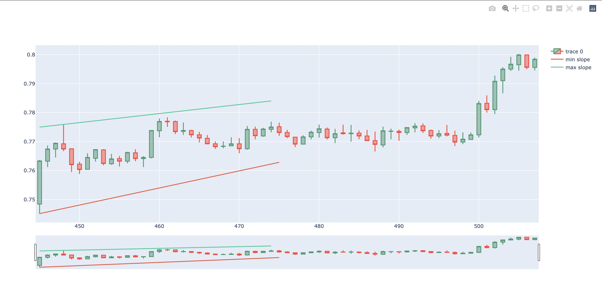

**Project: Trend Detection Robot**

Hi! This script is a simple example of building a Python based trading robot that downloads data from Binance via REST API and  then tries to detect the price trend by using a combination of Pandas, NumPy and Plotly. Based on pre-defined rules the robot optimises its parameters and provides the most relevant trend for a given time period.

### Example

